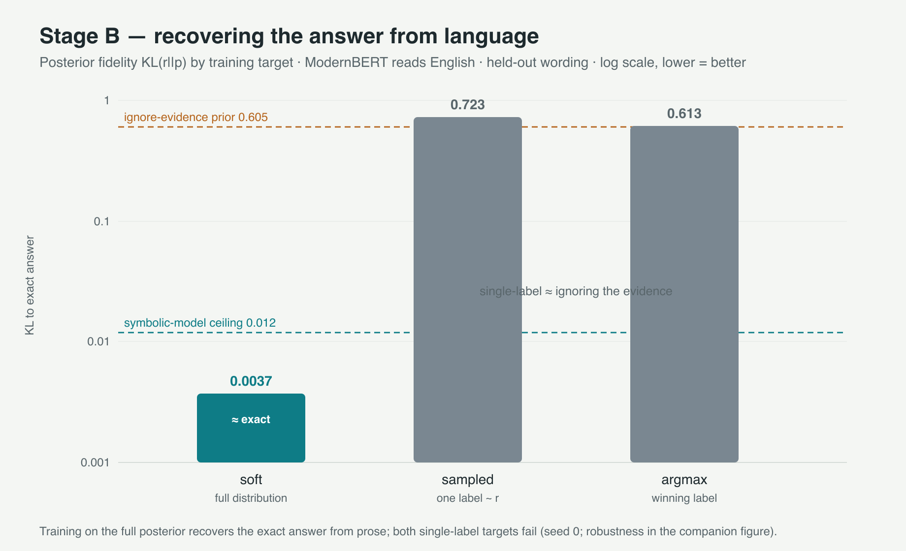
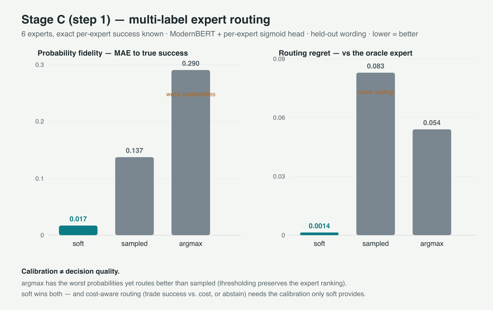

# certo

**Small models that know how sure they are.**

certo is a toolkit for building **narrow, calibrated decision models** — models that don't
generate text, they read a *state* and a set of *options* and return **calibrated probabilities**
(the confidence means what it says). They're trained on synthetic data with a *known answer key*,
so calibration is by construction rather than patched on afterward.

> **Status: research preview.** The code here reproduces the experiments and results below. The
> packaged `pip install certo` interface (inference API, checkpoint save/load, tuning helpers) and a
> demo checkpoint are in progress — see [Roadmap](#roadmap).

Project page & write-up: **https://altslate-labs.github.io/certo/**
Synthetic dataset (HF): **https://huggingface.co/datasets/rajpdus/certo-synthetic-decisions**

Inspired by Jev / "System-1" decision models. Independent project — **not affiliated with TypeSafe**.

---

## The idea

A decision model earns its keep when it says *"route to billing, 0.86"* and the 0.86 is
trustworthy — so you can escalate on doubt or trade quality against cost. Train on hard labels (the
usual way) and the model still picks well but turns **overconfident**.

certo trains against the **full answer distribution** (a proper scoring rule), and because the data
comes from a world with a **known posterior**, every model is graded against the *exact* answer —
not just accuracy, but **posterior fidelity** (KL/TV), which you can never measure on real data.


## Results (controlled, known-answer worlds)

Measured against the exact posterior on **held-out wording**; lower KL is better.

| finding | number |
|---|---|
| soft targets recover the exact posterior from English (ModernBERT) | **KL 0.004** |
| … robust across seeds; single-label targets fail (0.6–1.1) | see figure |
| hardening targets to the winner wrecks fidelity at ~matched accuracy | KL 0.67 vs 0.0002 (reference model) |
| the encoder learns **non-additive (interaction)** posteriors the additive rule can't | KL 0.04 vs 0.62 |
| **generic runtime options** — generalizes to unseen options/wording/counts | KL 0.13, acc 0.82 |
| multi-label **routing** — calibration is what enables cost-aware choice | regret 0.001 (soft) |




Full method, experiments, and honest limitations: [`DESIGN.md`](DESIGN.md).

## Reproduce

Requires `torch`, `transformers`, `numpy` (a Blackwell/CUDA box for the ModernBERT runs; the
synthetic world + verification run anywhere).

```bash
python datagen.py selftest          # 7-check verification of the synthetic world (+ interaction world)
python train.py compare             # symbolic: 2 models x 3 target arms, graded on posterior fidelity
python train.py compare --world ix  # interaction world (non-additive posterior)
python realize.py demo              # see states rendered as text
python train_text.py run   --arm soft --device cuda   # Stage B: recover the posterior from English
python train_route.py run  --arm soft --device cuda   # multi-label expert routing
python train_generic.py run --arm soft --device cuda  # generic runtime-option decision model
```

## What it's for — and what it isn't

**Good fit:** narrow decisions you can define or simulate (routing, triage, intent, verification,
ordinal scoring); anywhere *trustworthy confidence* matters (abstention, escalation, cost-aware
choice); local, on a small encoder — no large model, no API.

**Not this:** a general world-knowledge decision model (a small encoder is calibrated, not
omniscient); open-ended generation (certo returns typed probabilities); tasks you can neither
generate nor label.

## Roadmap

- [ ] `pip install certo` — `DecisionSpec` → `generate` → `train`, and `DecisionModel.load().decide()/route()/calibrate()`
- [ ] checkpoint save/load + a **demo checkpoint** on the HF Hub
- [ ] real-data validation (ARC/PIQA-style, accuracy + calibration)
- [ ] broaden decision structures (extraction, temporal, verification) toward a general base
- [ ] baseline: apply certo's soft-target recipe to a GLiClass-family backbone and measure the calibration gain

## Related work

The runtime-label classifier family — [GLiClass](https://arxiv.org/abs/2508.07662), GLiNER, and
open Jev rebuilds (SemIf, Laya) — nails the *mechanism* of scoring runtime options in one pass.
certo's contribution is **calibration by construction** on top of that interface.

## License

MIT — see [LICENSE](LICENSE).
