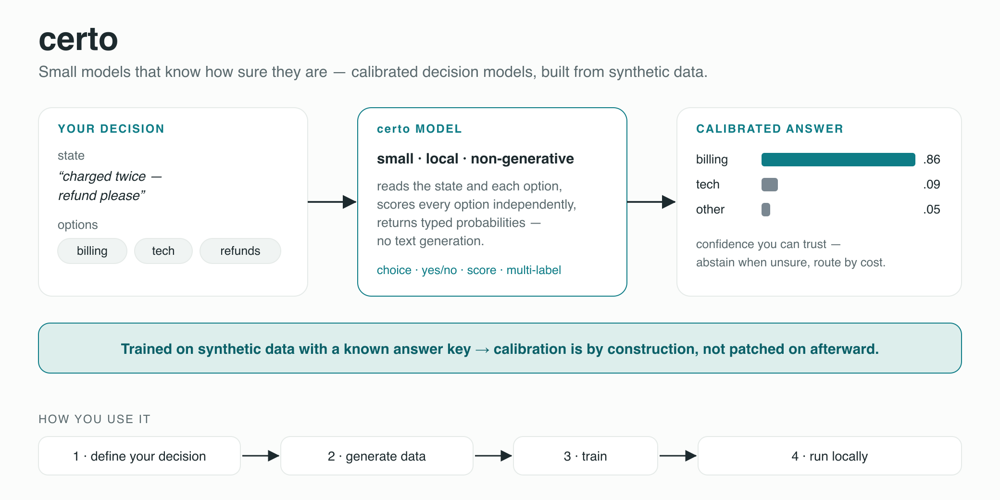
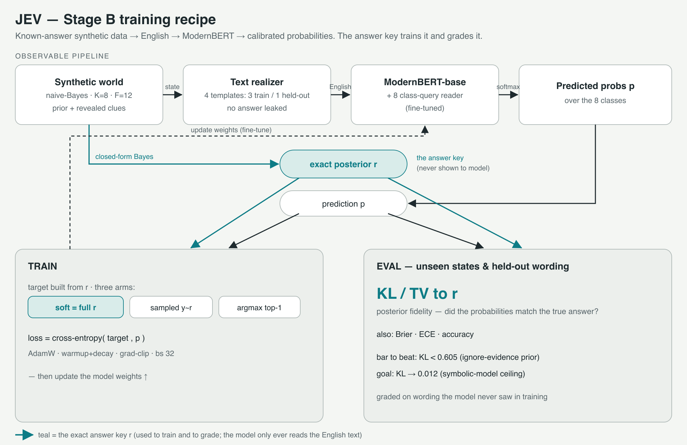
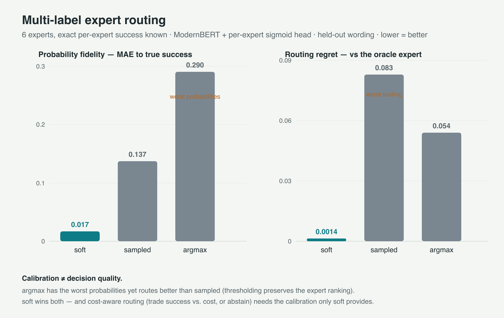
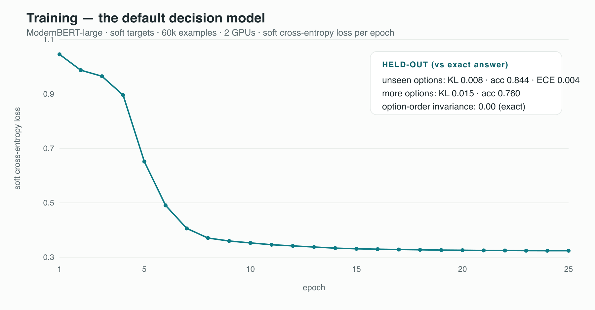

# certo


[](https://altslate-labs.github.io/certo/)
[](https://huggingface.co/datasets/rajpdus/certo-synthetic-decisions)
[](https://huggingface.co/altslate/certo-decision-model)

**Small models that know how sure they are.**

certo is a toolkit for building **narrow, calibrated decision models** — models that don't
generate text, they read a *state* and a set of *options* and return **calibrated probabilities**
(the confidence means what it says). Calibration comes from the training **recipe** — learn the full
answer distribution, not just the winning label — so it's by construction, not patched on afterward.
You train on whatever labels you have: a **known-answer synthetic world** (where calibration can be
*measured* exactly), your **own labeled data**, or a mix.



> **Status: research preview.** The code here reproduces the experiments and results below. The
> packaged `pip install certo` interface (inference API, checkpoint save/load, tuning helpers) and a
> demo checkpoint are in progress — see [Roadmap](#roadmap).

Project page: **https://altslate-labs.github.io/certo/** ·
Technical report: **https://altslate-labs.github.io/certo/report.html** ·
Synthetic dataset: **https://huggingface.co/datasets/rajpdus/certo-synthetic-decisions**

Inspired by Jev / "System-1" decision models. Independent project — **not affiliated with TypeSafe**.

---

## The idea

A decision model earns its keep when it says *"route to billing, 0.86"* and the 0.86 is
trustworthy — so you can escalate on doubt or trade quality against cost. Train on hard labels (the
usual way) and the model still picks well but turns **overconfident**.

certo trains against the **full answer distribution** (a proper scoring rule), and because the data
comes from a world with a **known posterior**, every model is graded against the *exact* answer —
not just accuracy, but **posterior fidelity** (how close the probabilities are to the truth), which
you can never measure on real data. That known-answer world is our *measurement* environment — on
real data you train the same way and grade with calibration + accuracy against outcomes.



## Synthetic or real data?

Both — the recipe is **provenance-aware**. It trains on **exact posteriors** from a known-answer
world (soft targets → measurable KL/TV), **real observed / gold labels** (ordinary supervised loss),
or **teacher estimates** (optional distillation) — each with the right loss, and kept distinct so
they're never confused (the canonical schema + validator live in [`prepare/`](prepare/)). Synthetic
known-answer worlds are how we can *measure* calibration exactly and one convenient way to generate
data — not the only source. The **v2 corpus** mixes rule-based generation with **public decision
datasets** (NLI, intent, emotion, reasoning) under strict licensing/leakage/split discipline — see
[`prepare/SPEC.md`](prepare/SPEC.md).

> **Honest note:** the current default **checkpoint** was trained only on synthetic data — a
> demonstrator. Training on your own data and real-dataset mixes is the toolkit's intended use and
> the v2 focus.

## What we found (controlled, known-answer worlds)

Measured against the exact answer on **held-out wording**; lower KL is better.

| finding | result |
|---|---|
| training on the full distribution recovers the exact answer from English | **KL 0.004** |
| … robust across seeds; single-label targets fail every time (0.6–1.1) | see figure |
| hardening targets to the winning label wrecks the probabilities at ~matched accuracy | KL 0.67 vs ~0 |
| the model learns **interaction** structure a per-feature rule provably can't | KL 0.04 vs 0.62 |
| **runtime options** — generalizes to options / wording / counts it never trained on | KL 0.13, acc 0.82 |
| **multi-label routing** — calibration is what enables cost-aware choice | near-oracle routing |




The full method, experiments, and honest limitations are in the **[technical report](https://altslate-labs.github.io/certo/report.html)**.

## The default model

A ModernBERT-large decision model trained on soft targets —
[**altslate/certo-decision-model**](https://huggingface.co/altslate/certo-decision-model).



Held-out (graded against the exact answer): **KL 0.008 · acc 0.844 · ECE 0.004** on options it never
saw; option-order invariance exact. It generalizes to unseen options/wording/counts — and it fails
*safely* (abstains) on free-flowing real prose it wasn't trained on (see the report). Use it locally:

```python
from huggingface_hub import snapshot_download
from certo import DecisionModel

m = DecisionModel.load(snapshot_download("altslate/certo-decision-model"))

r = m.decide(
    state="We measured tempo as gale, texture as dawn, density as ember.",
    options=[{"id": "Loam", "description": "typically texture dawn, tempo gale, density ember"},
             {"id": "Dune", "description": "typically texture gale, tempo dawn, density dawn"},
             {"id": "Moor", "description": "typically texture ember, tempo frost, density frost"}],
    abstain_below=0.6)

r["probs"]    # {'Loam': 0.99, 'Dune': 0.0, 'Moor': 0.0}   — real output, calibrated
r["top"]      # 'Loam'
r["abstain"]  # False   (it abstains when the evidence is ambiguous)
```

More real runs — confident matches, calibrated uncertainty, many options, order-invariance, and the
honest real-language boundary — are in **[`examples/`](examples/)**.

## Reproduce

Requires `torch`, `transformers`, `numpy` (a CUDA box for the language-model runs; the synthetic
world + verification run anywhere).

```bash
python datagen.py selftest             # 7-check verification of the synthetic world
python train.py compare                # 2 models x 3 target types, graded on posterior fidelity
python train.py compare --world ix     # world with interaction structure
python realize.py demo                 # see states rendered as text
python train_text.py run    --arm soft --device cuda   # recover the answer from English
python train_route.py run   --arm soft --device cuda   # multi-label expert routing
python train_generic.py run --arm soft --device cuda   # generic runtime-option model
```

## What it's for — and what it isn't

**Good fit:** narrow decisions you can define or simulate (routing, triage, intent, verification,
ordinal scoring); anywhere *trustworthy confidence* matters (abstention, escalation, cost-aware
choice); local, on a small encoder — no large model, no API.

**Not this:** a general world-knowledge decision model (a small encoder is calibrated, not
omniscient); open-ended generation (certo returns typed probabilities); tasks you can neither
generate nor label.

## Roadmap

- [ ] `pip install certo` — `DecisionSpec` → `generate` → `train`, and `DecisionModel.load().decide()/route()/calibrate()`
- [x] checkpoint save/load + inference API (`infer.py`) + a model on the HF Hub
- [ ] real-data validation (accuracy + calibration)
- [ ] broaden decision structures (extraction, temporal, verification) toward a general base
- [ ] baseline: apply certo's soft-target recipe to a GLiClass-family backbone and measure the calibration gain

## Related work

The runtime-label classifier family — [GLiClass](https://arxiv.org/abs/2508.07662), GLiNER, and open
Jev rebuilds — nails the *mechanism* of scoring runtime options in one pass. certo's contribution is
**calibration by construction** on top of that interface.

## License

MIT — see [LICENSE](LICENSE).
